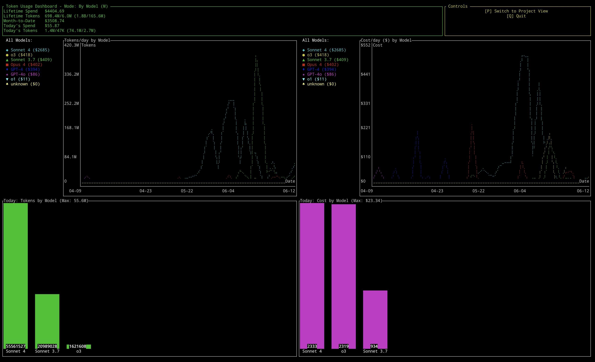

# Token Usage Dashboard

A real-time terminal dashboard for tracking Claude and OpenAI token usage and costs across all your projects when you use Claude Code or Goose CLI. This dashboard provides a comprehensive overview of your token consumption, costs, and trends, helping you manage your AI expenses effectively.



## Features

- 🔄 **Real-time monitoring** - Updates every 10 seconds
- 📊 **Visual charts** - Line graphs for usage trends, bar charts for daily breakdowns
- 💰 **Cost tracking** - Accurate pricing for all major models including cache costs
- 🎯 **Smart filtering** - Shows top 5 most expensive models with legend
- 📈 **Multiple views** - Lifetime, month-to-date, and daily spending
- 🚀 **Fast performance** - Intelligent caching system for quick updates
- 🔧 **Multi-source** - Supports both Claude Code and Goose CLI logs

## Supported Models

### Claude Models
- **Claude Sonnet 4** - Latest high-performance model
- **Claude Opus 4** - Most capable model
- **Claude Sonnet 3.7** - Updated Sonnet variant
- **Claude 3.5 Sonnet/Haiku** - Previous generation models

### OpenAI Models  
- **o3** - Latest reasoning model
- **o1** - Advanced reasoning model
- **GPT-4o** - Multimodal flagship
- **GPT-4** - Standard GPT-4 variants

## Installation

### Prerequisites
- **Rust** (latest stable)
- **Claude Code CLI** or **Goose** with conversation logs

### Quick Start

1. **Clone the repository**
   ```bash
   git clone https://github.com/yourusername/token-dashboard.git
   cd token-dashboard
   ```

2. **Build the dashboard**
   ```bash
   cargo build --release
   ```

3. **Run the dashboard**
   ```bash
   cargo run
   ```

## Usage

### Running the Dashboard
```bash
# Standard usage
cargo run

# Or use the release build
./target/release/token-dashboard
```

### Controls
- **`q` or `Esc`** - Quit the dashboard
- **Auto-refresh** - Updates every 10 seconds

### Understanding the Display

The dashboard shows four main sections:

1. **Summary Panel** (top)
   - Lifetime spend and token counts
   - Month-to-date totals
   - Today's usage and costs

2. **Usage Trends** (top-left chart)
   - Daily token usage over time
   - Shows top 5 models by total spend
   - Color-coded lines with legend

3. **Cost Trends** (top-right chart)  
   - Daily cost over time
   - Same top 5 model filtering
   - Dollar amounts on Y-axis

4. **Daily Breakdowns** (bottom charts)
   - Today's usage by model (tokens and cost)
   - Bar charts showing current day totals

## Where does the data come from?

The dashboard automatically scans conversation logs from:

- **Claude Code logs**: `~/.claude/projects/` - Contains `.jsonl` files with conversation history
- **Goose CLI logs**: `~/.local/state/goose/logs/cli/` - Contains session logs with token usage

These directories contain the raw conversation data that gets parsed to extract token usage and calculate costs. If you don't see any data, make sure you have used Claude Code or Goose CLI and have conversation logs in these locations.

## Configuration

### Data Sources

The dashboard automatically scans these locations:

- **Claude Code logs**: `~/.claude/projects/`
- **Goose CLI logs**: `~/.local/state/goose/logs/cli/`

### Cache Management

Parser data is cached for performance:
- **Cache location**: `~/.cache/claude-token-burn/`
- **Cache behavior**: Only re-parses modified files
- **Clear cache**: `rm -rf ~/.cache/claude-token-burn/`

### Custom Paths

The dashboard automatically detects log directories. If you need custom paths, they can be configured in the source code.

## Architecture

### Components

- **`src/main.rs`** - Terminal UI dashboard built with ratatui
- **`src/parser.rs`** - Native Rust parser for conversation logs and cost calculation
- **Cache system** - Intelligent file caching for fast performance

### Data Flow

1. **Parser** scans `.jsonl` conversation files and Goose logs
2. **Extracts** token usage and model information  
3. **Calculates** costs using built-in pricing tables
4. **Caches** results with intelligent modification detection
5. **Dashboard** renders real-time UI with live data

### Cost Calculation

Costs are calculated using official pricing:
- **Input tokens** - Standard per-model rates
- **Output tokens** - Higher rates for generation
- **Cache creation** - One-time cost for prompt caching
- **Cache reads** - Reduced cost for cached content

## Development

### Project Structure
```
token-dashboard/
├── src/
│   ├── main.rs          # Dashboard UI code
│   └── parser.rs        # Native Rust log parser
├── Cargo.toml           # Rust dependencies
├── LICENSE              # MIT license
└── README.md            # This file
```

### Building
```bash
# Debug build
cargo build

# Release build (faster)
cargo build --release

# Run with live reload during development
cargo run
```

### Adding New Models

1. **Add pricing** to `MODEL_PRICING` in `src/parser.rs`
2. **Add normalization** logic in `normalize_model_name()`
3. **Test** with sample data

Example:
```rust
m.insert("New Model", ModelPricing {
    input_tokens: 0.005,
    output_tokens: 0.015,
    input_tokens_cache_write: Some(0.00625),
    input_tokens_cache_read: Some(0.0005),
});
```

## Troubleshooting

### No Data Showing
- Check that you have Claude Code or Goose conversation logs
- Verify log directories exist: `~/.claude/projects/` or `~/.local/state/goose/logs/cli/`
- Test data loading: `cargo run -- --test`

### Costs Showing as $0
- Model might not have pricing defined
- Check `normalize_model_name()` function maps your model correctly
- Verify pricing table includes the normalized model name

### Terminal Display Issues
- Ensure terminal supports colors and is large enough
- Try different terminal emulators
- Check that you're running in an actual TTY (not piped output)

### Performance Issues
- Clear cache if it becomes corrupted: `rm -rf ~/.cache/claude-token-burn/`
- Large log directories may take time on first scan
- Subsequent runs should be fast due to caching

## Future Work

1. **Single-binary distribution** – `cargo install token-dashboard` support
2. **Plugin system** – allow new log sources (OpenAI audit logs, Azure billing) via Rust trait objects
3. **Configuration file** – YAML-based pricing and settings configuration

## Contributing

1. **Fork** the repository
2. **Create** a feature branch
3. **Make** your changes
4. **Test** thoroughly
5. **Submit** a pull request

### Areas for Contribution
- Additional model support
- New visualization types
- Export capabilities
- Configuration options
- Performance improvements

## License

MIT License - see LICENSE file for details.

## Acknowledgments

- Built with [ratatui](https://github.com/ratatui-org/ratatui) for terminal UI
- Supports [Claude Code](https://claude.ai/code) and [Goose](https://github.com/square/goose) workflows
- Pricing data from official Anthropic and OpenAI documentation
